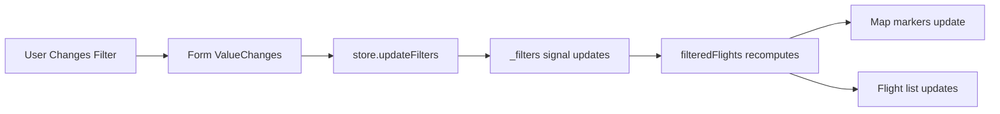

## Overview

Air Tracker provides powerful filtering capabilities to help users find specific flights. Filters are applied in real-time and automatically update the map and flight list.

<CardGroup cols={2}>
  <Card title="Operator Filtering" icon="building">
    Filter by airline or operator name
  </Card>
  <Card title="Ground Status" icon="plane-arrival">
    Show flying, grounded, or all aircraft
  </Card>
</CardGroup>

## Filter Model

Filters are defined using a simple interface:

```typescript
// From flight-filters.ts
export interface FlightFilters {
  operator: string | null;     // Selected operator/airline name
  onGround: 'all' | 'flying' | 'onGround';  // Ground status filter
}
```

<Info>
The filter model is stored as a signal in the `FlightsStoreService`, enabling reactive updates throughout the application.
</Info>

## Filter Component

### Component Structure

The `FlightsFilterMenuComponent` provides the filter UI:

```typescript
@Component({
  selector: 'app-flights-filter-menu',
  imports: [
    MatIconModule,
    MatMenuModule,
    MatListModule,
    ReactiveFormsModule,
    MatRadioModule,
    MatFormFieldModule,
    MatSelectModule,
    MatButtonModule,
  ],
  templateUrl: './flights-filter-menu.component.html',
  styleUrl: './flights-filter-menu.component.scss',
})
export class FlightsFilterMenuComponent implements OnInit {
  store = inject(FlightsStoreService);
  private readonly destroyRef = inject(DestroyRef);
  
  filterForm = new FormGroup({
    operator: new FormControl<string[] | null>(['']),
    onGround: new FormControl<'all' | 'flying' | 'onGround'>('all')
  });
  
  ngOnInit() {
    this.filterForm.valueChanges
      .pipe(takeUntilDestroyed(this.destroyRef))
      .subscribe(value => {
        const operatorArray = value.operator ?? [];
        const operator = operatorArray[0] || null;
        
        this.store.updateFilters({
          operator,
          onGround: value.onGround ?? 'all',
        });
      });
  }
}
```

<Note>
The component uses reactive forms to track filter changes and automatically updates the store whenever a filter value changes.
</Note>

## Operator/Airline Filtering

### Operator List Generation

The store automatically generates a unique list of operators from the current flights:

```typescript
// From FlightsStoreService

/**
 * Unique list of operators for filter dropdown
 * - Transforms null operators to 'Other'
 * - Automatically updates when flights change
 * - Sorted alphabetically (Other at the end)
 */
readonly operatorList = computed(() => {
  const flights = this._flights();
  const operators = flights
    .map(f => f.operator === null ? 'Other' : f.operator)
    .filter(Boolean);
  
  return [...new Set(operators)].sort((a, b) => {
    if (a === 'Other' && b !== 'Other') return 1;
    if (b === 'Other' && a !== 'Other') return -1;
    if (a === 'Other' && b === 'Other') return 0;
    return a.localeCompare(b, undefined, { sensitivity: 'base' });
  });
});
```

<Tabs>
  <Tab title="Transformation">
    - `null` operators → `"Other"`
    - Duplicates removed with `Set`
    - Empty strings filtered out
  </Tab>
  <Tab title="Sorting">
    - Alphabetical (case-insensitive)
    - `"Other"` always appears last
    - Uses `localeCompare` for proper international sorting
  </Tab>
  <Tab title="Reactivity">
    - Computed signal automatically updates
    - Re-runs when `_flights()` signal changes
    - No manual refresh needed
  </Tab>
</Tabs>

### Operator Filter UI

```html
<mat-form-field>
  <mat-label>Operator</mat-label>
  <mat-select formControlName="operator" multiple>
    <mat-option value="">All Operators</mat-option>
    @for (operator of store.operatorList(); track operator) {
      <mat-option [value]="operator">{{ operator }}</mat-option>
    }
  </mat-select>
</mat-form-field>
```

<Tip>
The operator dropdown is populated dynamically from the computed `operatorList` signal, so it always reflects the current set of flights.
</Tip>

### Operator Filtering Logic

```typescript
// From FlightsStoreService - filteredFlights computed signal

readonly filteredFlights = computed(() => {
  const allFlights = this._flights();
  const { operator, onGround } = this._filters();
  
  return allFlights.filter(flight => {
    // Filter by operator
    if (!operator || operator === '') return true;  // No filter
    
    if (operator === 'Other') {
      return flight.operator == null || flight.operator === '';
    }
    
    return flight.operator === operator;
  }).filter(flight => {
    // Filter by ground status (chained below)
    // ...
  });
});
```

**Filter Behavior:**

| Filter Value | Flights Shown |
|--------------|---------------|
| `null` or `""` | All flights (no filtering) |
| `"Other"` | Flights with `null` or empty operator |
| Any operator name | Flights matching that exact operator |

## Ground Status Filtering

### Ground Status Options

<CardGroup cols={3}>
  <Card title="All" icon="globe">
    Show all aircraft regardless of status
  </Card>
  <Card title="Flying" icon="plane">
    Show only airborne aircraft
  </Card>
  <Card title="On Ground" icon="warehouse">
    Show only grounded aircraft
  </Card>
</CardGroup>

### Ground Status UI

```html
<mat-radio-group formControlName="onGround">
  <mat-radio-button value="all">All</mat-radio-button>
  <mat-radio-button value="flying">Flying</mat-radio-button>
  <mat-radio-button value="onGround">On Ground</mat-radio-button>
</mat-radio-group>
```

### Ground Status Filtering Logic

```typescript
// From FlightsStoreService - filteredFlights computed signal

readonly filteredFlights = computed(() => {
  const allFlights = this._flights();
  const { operator, onGround } = this._filters();
  
  return allFlights
    .filter(/* operator filter */)  // First filter by operator
    .filter(flight => {
      // Then filter by ground status
      if (onGround === 'all') return true;
      if (onGround === 'flying') return !flight.onGround;
      if (onGround === 'onGround') return flight.onGround;
      return true;
    });
});
```

**Filter Logic:**

| Filter Value | Condition | Flights Shown |
|--------------|-----------|---------------|
| `'all'` | Always true | All flights |
| `'flying'` | `!flight.onGround` | Only airborne |
| `'onGround'` | `flight.onGround` | Only grounded |

<Info>
The `onGround` property comes from the flight telemetry data and indicates whether the aircraft is currently on the ground.
</Info>

## Combined Filtering

Filters are applied sequentially, allowing for powerful combinations:

```typescript
readonly filteredFlights = computed(() => {
  const allFlights = this._flights();
  const { operator, onGround } = this._filters();
  
  return allFlights
    // Step 1: Filter by operator
    .filter(flight => {
      if (!operator || operator === '') return true;
      if (operator === 'Other') {
        return flight.operator == null || flight.operator === '';
      }
      return flight.operator === operator;
    })
    // Step 2: Filter by ground status
    .filter(flight => {
      if (onGround === 'all') return true;
      if (onGround === 'flying') return !flight.onGround;
      if (onGround === 'onGround') return flight.onGround;
      return true;
    });
});
```

<Tabs>
  <Tab title="Example 1">
    **Filter:** `operator = "Iberia"`, `onGround = "flying"`
    
    **Result:** Only Iberia aircraft that are currently airborne
  </Tab>
  <Tab title="Example 2">
    **Filter:** `operator = "Other"`, `onGround = "onGround"`
    
    **Result:** Only grounded aircraft with no operator information
  </Tab>
  <Tab title="Example 3">
    **Filter:** `operator = null`, `onGround = "all"`
    
    **Result:** All flights (no filtering)
  </Tab>
</Tabs>

## Real-Time Filter Updates

### Reactive Flow

The filtering system uses Angular signals for instant UI updates:



### Update Method

```typescript
// From FlightsStoreService

/**
 * Update filters partially (merge with current)
 * @param newFilters - Partial filter updates
 * @example store.updateFilters({ operator: 'Iberia' })
 */
updateFilters(newFilters: Partial<FlightFilters>): void {
  this._filters.update(current => ({ ...current, ...newFilters }));
}
```

<Note>
The `update` method merges new filter values with existing ones, so you can update individual filters without affecting others.
</Note>

### Automatic UI Updates

Because `filteredFlights` is a computed signal, all components consuming it update automatically:

```typescript
// In FlightsShellComponent
@Component({
  selector: 'app-flights-shell',
  template: `
    <!-- Map automatically shows only filtered flights -->
    <app-flights-map [flights]="store.filteredFlights()"></app-flights-map>
    
    <!-- List automatically shows only filtered flights -->
    <app-flights-list [flights]="store.filteredFlights()"></app-flights-list>
    
    <!-- Filter menu bound to store -->
    <app-flights-filter-menu></app-flights-filter-menu>
  `
})
export class FlightsShellComponent {
  store = inject(FlightsStoreService);
}
```

<Tip>
No manual subscription or change detection is needed - Angular signals handle all reactivity automatically.
</Tip>

## Filter State Management

### Initial State

```typescript
private readonly _filters = signal<FlightFilters>({
  operator: null,    // No operator filter
  onGround: 'all'    // Show all flight statuses
});
```

### Reading Current Filters

```typescript
// Get current filter values
const currentFilters = store._filters();
console.log(currentFilters);
// { operator: "Iberia", onGround: "flying" }
```

### Updating Filters

```typescript
// Update single filter
store.updateFilters({ operator: 'Lufthansa' });

// Update multiple filters
store.updateFilters({ 
  operator: 'Air France', 
  onGround: 'flying' 
});

// Clear operator filter
store.updateFilters({ operator: null });

// Reset to defaults
store.updateFilters({ operator: null, onGround: 'all' });
```

## Filter Performance

### Computed Signal Optimization

Angular's computed signals are highly optimized:

- **Memoization**: Results are cached until dependencies change
- **Lazy Evaluation**: Only recomputes when accessed
- **Automatic Dependency Tracking**: Knows exactly when to recompute

```typescript
// This computed signal only reruns when _flights or _filters change
readonly filteredFlights = computed(() => {
  const allFlights = this._flights();  // Dependency 1
  const { operator, onGround } = this._filters();  // Dependency 2
  
  return allFlights.filter(/* ... */);
});
```

<Info>
Even with thousands of flights, filtering is instant because computed signals efficiently track dependencies and minimize unnecessary recalculations.
</Info>

## Usage Example

```typescript
import { Component, inject } from '@angular/core';
import { FlightsStoreService } from './services/flights-store.service';

@Component({
  selector: 'app-filter-demo',
  template: `
    <div>
      <h2>Filters</h2>
      
      <!-- Operator dropdown -->
      <select (change)="onOperatorChange($event)">
        <option value="">All Operators</option>
        @for (op of store.operatorList(); track op) {
          <option [value]="op">{{ op }}</option>
        }
      </select>
      
      <!-- Ground status radio buttons -->
      <label>
        <input type="radio" value="all" 
               [checked]="store._filters().onGround === 'all'"
               (change)="onGroundStatusChange('all')">
        All
      </label>
      <label>
        <input type="radio" value="flying"
               [checked]="store._filters().onGround === 'flying'"
               (change)="onGroundStatusChange('flying')">
        Flying
      </label>
      <label>
        <input type="radio" value="onGround"
               [checked]="store._filters().onGround === 'onGround'"
               (change)="onGroundStatusChange('onGround')">
        On Ground
      </label>
      
      <!-- Results -->
      <p>Showing {{ store.filteredFlights().length }} flights</p>
    </div>
  `
})
export class FilterDemoComponent {
  store = inject(FlightsStoreService);
  
  onOperatorChange(event: Event) {
    const value = (event.target as HTMLSelectElement).value;
    this.store.updateFilters({ operator: value || null });
  }
  
  onGroundStatusChange(status: 'all' | 'flying' | 'onGround') {
    this.store.updateFilters({ onGround: status });
  }
}
```

## Filter Persistence

<Note>
Currently, filters reset when the page is refreshed. To persist filters across sessions, consider storing them in `localStorage` or URL query parameters.
</Note>

### Example: LocalStorage Persistence

```typescript
// Save filters to localStorage
private saveFiltersToStorage(): void {
  localStorage.setItem('flight-filters', JSON.stringify(this._filters()));
}

// Load filters from localStorage
private loadFiltersFromStorage(): FlightFilters {
  const stored = localStorage.getItem('flight-filters');
  if (stored) {
    return JSON.parse(stored);
  }
  return { operator: null, onGround: 'all' };
}

// Initialize with stored filters
constructor() {
  const savedFilters = this.loadFiltersFromStorage();
  this._filters.set(savedFilters);
  
  // Save on every change
  effect(() => {
    this.saveFiltersToStorage();
  });
}
```
